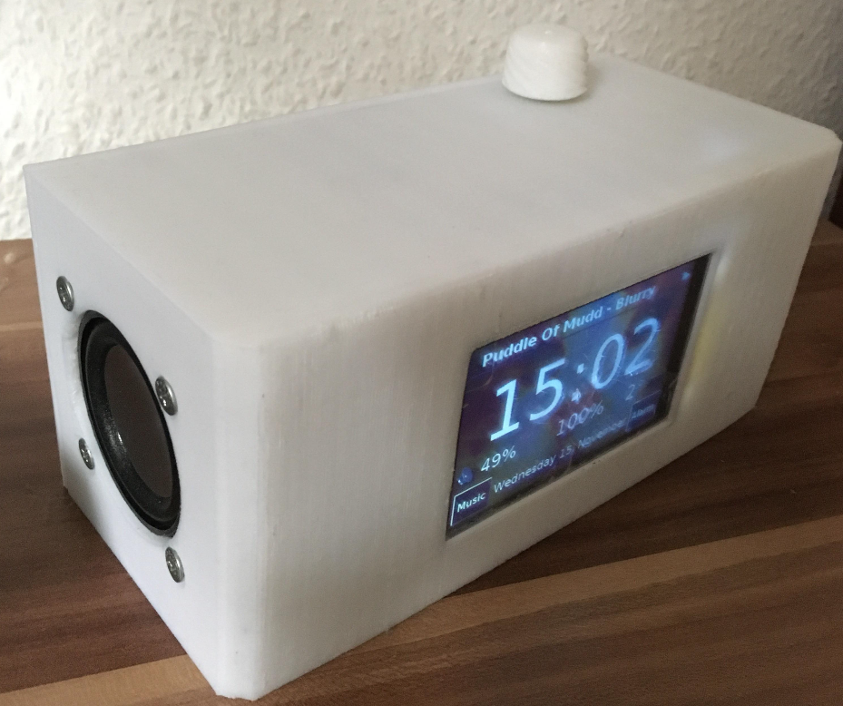
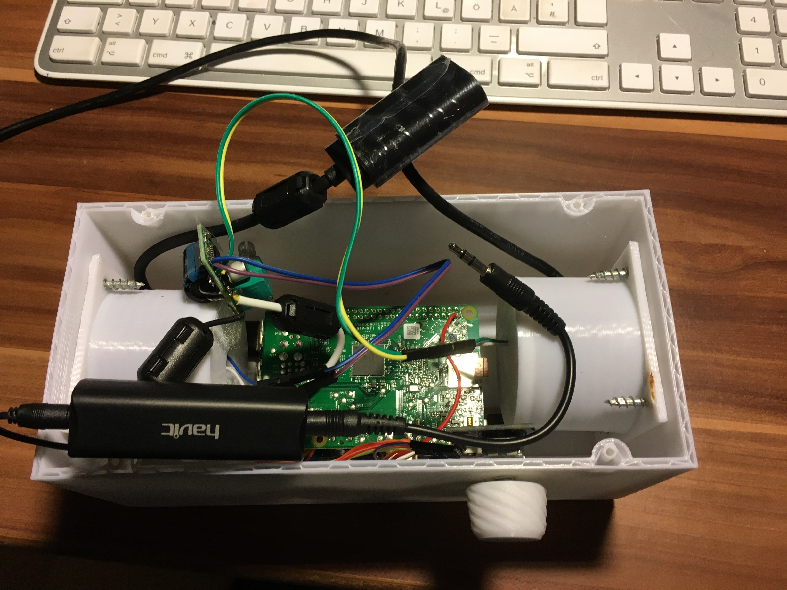
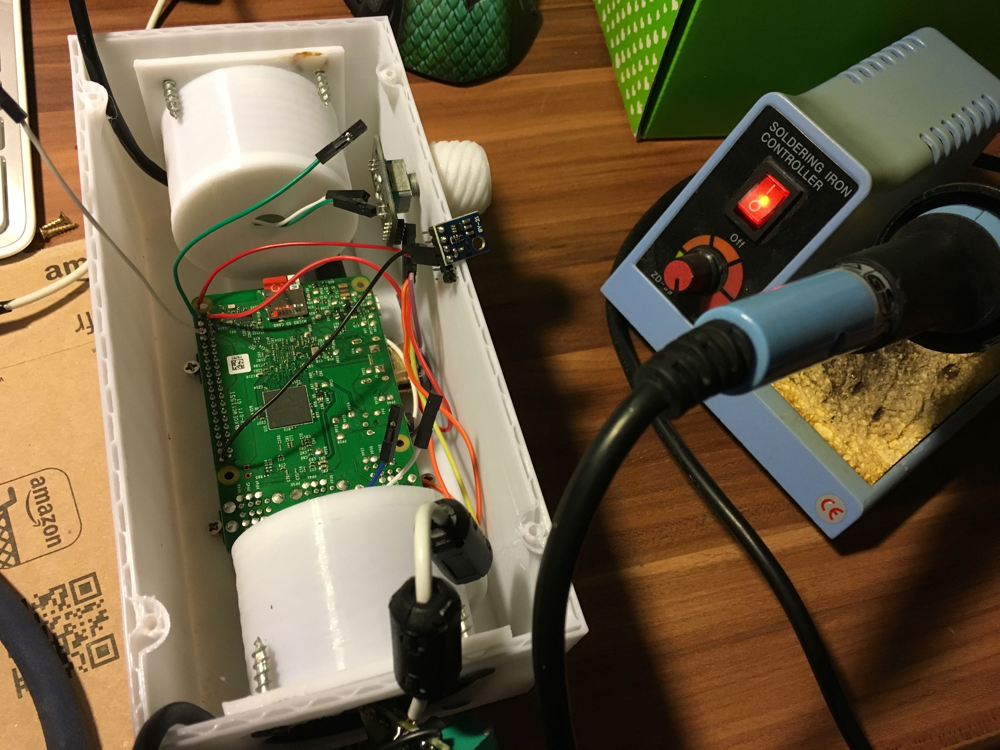
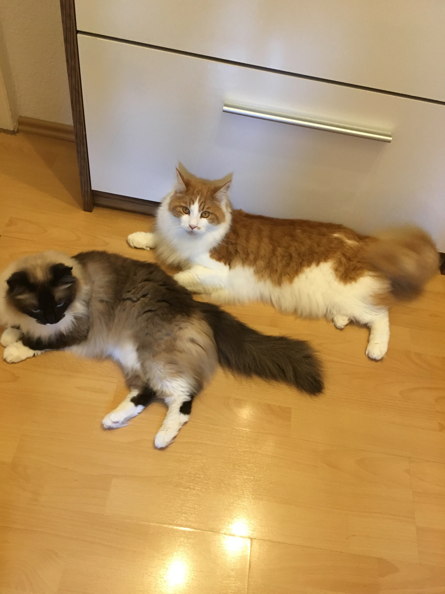

# PiClock

!WARNING this thing is under heavy construction!

Hi there,
this is a Clock made with a Raspberry Pi!

sorry its not well commented yet, i'm still working on it.

# Requiremnts 

You have to compile the project on your R-Pi (or your can crosscompile on your machine, 
but I think it is not worth it)

You need Qt to compile it.

- installation instruction comming soon

- qmake 
- make
- ./PiClock

to play Music you need to install Mopidy ( https://www.mopidy.com/ ). You can play your own mp3 files, webstreams or connect to spotify, SoundCloud or GooglePlay.

feel free to make some feature requests or bugreports!

here some pictures for you.

#HARDWARE:
Raspberry Pi 3
(NO this aint no affiliate links!!!)

Display: 3.5" Touchscreen https://www.amazon.de/gp/product/B071JDSS1W/ref=oh_aui_detailpage_o09_s00?ie=UTF8&psc=1

Sound: external usb sound card: https://www.amazon.de/gp/product/B01N905VOY/ref=oh_aui_detailpage_o07_s00?ie=UTF8&psc=1

Amp: 5V - 3W stereo https://www.amazon.de/gp/product/B01MR169J8/ref=oh_aui_detailpage_o02_s00?ie=UTF8&psc=1

Volume Knob: https://www.amazon.de/gp/product/B01G1EWAAG/ref=oh_aui_detailpage_o00_s00?ie=UTF8&psc=1

Speaker: 2" 3W Full Range https://www.amazon.de/gp/product/B073XH8KK8/ref=oh_aui_detailpage_o03_s00?ie=UTF8&psc=1

Noise Reduction: 

Ground Loop Noise Isolator: https://www.amazon.de/gp/product/B01IETQQQK/ref=oh_aui_detailpage_o09_s00?ie=UTF8&psc=1
Ferrite core: https://www.amazon.de/gp/product/B01E5ALVWQ/ref=oh_aui_detailpage_o08_s00?ie=UTF8&psc=1

#SOFTWARE: - default raspberry py OS (jessy) - the app is written in QT/C++ - WeatherData https://openweathermap.org/
//

and this are my cats Nala & Kurt!

greetz!

